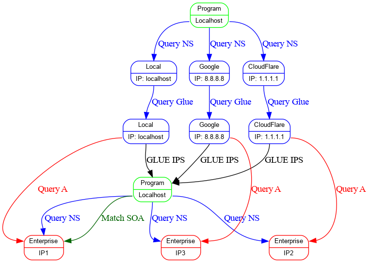

# DNSTracer

A tool to automate troubleshooting DNS issues for delegated zones

## Usage

Head to the [Releases Page](https://github.com/Redislabs-Solution-Architects/dnstracer/releases) and download the release for either Darwin(Mac) or Linux
Be sure to change the permissions so that the binary is executable

```
chmod +x dnstracer_0.0.4_linux_amd64
```

### Get Help

```
$ ./build/dnstracer_0.0.4_linux_amd64  -h
Usage: dnstracer [-dhis] [-e value] [parameters ...]
 -d, --debug     Enable debug output
 -e, --endpoint=value
                 The name of the redis endpoint eg:
                 redis-10000.foo.example.com
 -h, --help      display help
 -i, --internal  Use only internal resolvers (only on Linux)
 -s, --suggest   Suggest possible fixes
```

### Resolution Settings

If not set to use internal resolvers, dnstracer will attempt to use Google and Cloudflare's publicly available DNS servers to troubleshoot.
When the Redis Enterprise servers are *not* publicly available use the internal option


### Check a cluster we know is broken

```
$ ./build/dnstracer_0.0.4_linux_amd64  -d redis-10002.azure1.mague.com
Error - run with --debug for more information or run with --suggest for hints on how to fix
```

### Check a cluster and provide some possible suggestions for fixes

```
$ ./build/dnstracer_0.0.4_linux_amd64  -e redis-10002.azure1.mague.com --suggest
--------------------------------
	      NS Record Test: OK
	    Glue Record Test: OK
	      NS Access Test: ERROR
	       A Record Test: OK
--------------------------------
Suggestions for redis-10002.azure1.mague.com
--------------------------------
NS Access Suggestions
--------------------------------
Unable to query one or more of the delegated nameservers

Please make sure the DNS server is running with the command
	supervisorctl status  pdns_server

Please make sure the DNS port is not firewalled to external sources

Please use the following commands to troubleshoot:
	dig +noall +answer NS azure1.mague.com @20.36.28.197
	dig +noall +answer NS azure1.mague.com @40.65.114.126
	dig +noall +answer NS azure1.mague.com @52.250.9.35
```

### If all else fails and you've found a new failure scenario I may have missed : run with debug and submit an issue

```
$ ./build/dnstracer_0.0.4_linux_amd64  -e redis-10002.azure1.mague.com --debug
--------------------------------
	      NS Record Test: OK
	    Glue Record Test: OK
	      NS Access Test: ERROR
	       A Record Test: OK
--------------------------------
Results Debug:
{ResultA:true ResultNS:true ResultGlue:true ResultAccess:false}
--------------------------------
&{LocalA:[20.36.28.197] DNS2A:[20.36.28.197] DNS1A:[20.36.28.197] LocalNS:[ns1.azure1.mague.com. ns2.azure1.mague.com. ns3.azure1.mague.com.] DNS2NS:[ns1.azure1.mague.com. ns2.azure1.mague.com. ns3.azure1.mague.com.] DNS1NS:[ns1.azure1.mague.com. ns2.azure1.mague.com. ns3.azure1.mague.com.] LocalGlue:[20.36.28.197 40.65.114.126 52.250.9.35] DNS2Glue:[20.36.28.197 40.65.114.126 52.250.9.35] DNS1Glue:[20.36.28.197 40.65.114.126 52.250.9.35] PublicMatchA:true LocalMatchA:true PublicMatchNS:true LocalMatchNS:true PublicMatchGlue:true LocalMatchGlue:true EndpointStatus:[true false true]}
{ResultA:true ResultNS:true ResultGlue:true ResultAccess:false}
Error - run with --debug for more information or run with --suggest for hints on how to fix
```

## Lookups Being performed



